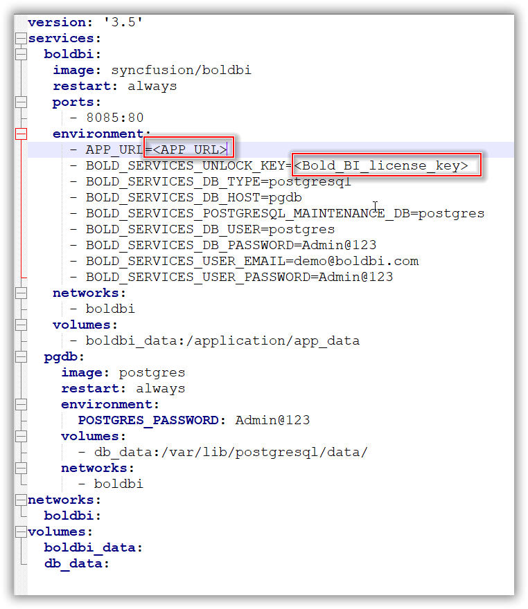
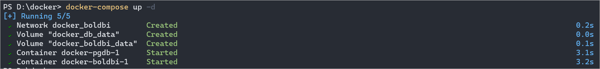
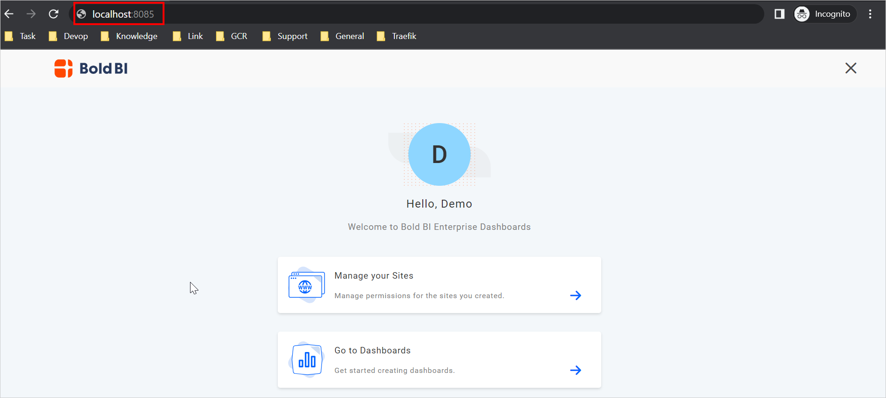
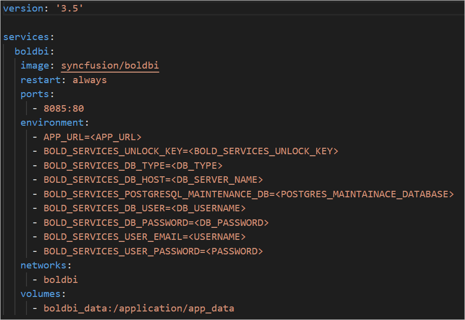

<a href="https://www.boldbi.com"></a>
<br/>
<br/>

[](https://github.com/boldbi/boldbi-docker/releases/latest)
[](https://help.boldbi.com/embedded-bi)
[](https://www.boldbi.com/support)

# What is Bold BI

Bold BI is a powerful business intelligence dashboard software that helps you to get meaningful insights from your business data and make better decisions.

It is an end-to-end solution for creating, managing, and sharing interactive business dashboards that include a powerful dashboard designer for composing easily.

With deep embedding, you can interact more with your data and get insights directly from your application.

# Deployment Prerequisites

### Hardware requirements

The following hardware requirements are necessary to run the Bold BI solution:

* Operating System: Use the Bold BI Docker on the following operating systems: 
  * Windows
  * Linux
  * Mac
* CPU: 2-core.
* Memory: 4 GB RAM.
* Disk Space: 8 GB or more.

### Software requirements

The following software requirements are necessary to run the Bold BI Enterprise edition:

* Database: Microsoft SQL Server 2012+ | PostgreSQL | MySQL
* Application: [Docker](https://docs.docker.com/engine/) and [Docker Compose](https://docs.docker.com/compose/). 
* Web Browser: Microsoft Edge, Mozilla Firefox, and Chrome.

# Supported tags

| Tags               | OS Version    | Last Modified(MM/DD/YYYY)|
| -------------      | ------------- | ------------- |
| `6.8.9`, `latest` | Debian 10  (amd64,arm64)    | 07/05/2023 |
| `6.8.9-alpine`    | Alpine 3.13  (amd64)  | 07/05/2023 |
| `6.8.9-focal`     | Ubuntu 20.04  (amd64)       | 07/05/2023 |
|`6.8.9-arm64`      | Debian 10 (arm64)|07/05/2023

# How to use this image

The above Bold BI image can be deployed using Docker or Docker Compose. In the following section, starts BoldBI and a separate PostgreSQL instance with volume mounts for data persistence.

### Using Docker Compose 

1. Download docker compose file using the following command.
   ```sh
   curl -o docker-compose.yml "https://raw.githubusercontent.com/Vinoth-Krishnamoorthy/boldbi-docker/main/deploy/single-container/docker-compose.yml"
   ```
2. Open the docker compose file and fill the mandatory fields - <b>APP_URL</b> and <b>Unlock Key</b>.

    

      #### **APP_URL Guidance:**
      * Provide the HTTP scheme for APP_URL value.
      For example, <br/>
          `http://example.com` <br/>
          `http://<public_ip_address>` <br/>
      * For `Windows` and `MacOS` use either http://host.docker.internal or http://localhost. Docker Desktop provides `host.docker.internal` and `gateway.docker.internal` DNS for communication between docker applications and host machine. Please make sure that the host.docker.internal DNS has your IPv4 address mapped in your hosts file on Windows(C:\Windows\System32\drivers\etc\hosts).
      * For `Linux` use the Machine Public IP address as the value for APP_URL with the HTTP scheme.

4. Run docker compose up command.
   ```sh
   docker-compose up -d
   ```
   
5. After running the command, access the Bold BI App by entering APP_URL in a browser.
   

# Environment Variables and It's Usage

Bold BI accepts the following environment variables: 

| Name                          |Required| Description   | 
| -------------                 |----------| ------------- | 
| `APP_URL`                     |No <br /><br /><br /> Needed when configuring with domain or IP| Domain or IP address with http/https protocol.<br/>For example, <br/>`http://<public_DNS_address>`<br/>`http://<public_ip_address>` <br/><br/>The default APP_URL is `http://localhost`<br/><br/> <b>Note:</b><br/>•	If you are using the IP address for the Base URL, ensure you are using the public IP of the machine instead of internal IP or local IP address. Applications can communicate with each other using the public IP alone. Host machine IP will not be accessible inside the application container.<br/>• For linux depoyment the default APP_URL is http://localhost or http://172.17.0.1<br/>• You can provide the HTTP or HTTPS scheme for APP_BASE_URL value.<br/>• Please refer to this section for [SSL Termination](docs/ssl-termination.md).|
|`OPTIONAL_LIBS`|No|	These are the client libraries used in Bold BI by default.<br/><br/>`'mongodb,mysql,influxdb,snowflake,oracle,clickhouse,google'`<br/><br/>Please refer [Consent to deploy client libraries](docs/consent-to-deploy-client-libraries.md) Libraries section to know more.|
| `widget_bing_map_enable`      |No| If you need to use Bing Map widget feature, enable this to `true`.<br/>By default, this feature is set to `false`. | 
| `widget_bing_map_api_key`     |No| API key value for the Bing Map. |
| `AppSettings__CustomSizePDFExport`|No|To utilize a customized page size for A4 PDF export, set this feature to `true`. By default, this feature is set to `false`.|
| `AppSettings__BrowserTimezone`|No|If you need to use Browser time zone feature , enable this to `true`. By default, this feature is set to `false`.|
|`boldbi_data` |No|Persistent volume for the Bold BI application data|
|`db_data` |No|Persistent volume for the Nginx configuration|

<br/>

### How to deploy Bold BI using existing DB server? 
1. Download docker compose file using the following command.
   ```sh
   curl -o docker-compose.yml "https://raw.githubusercontent.com/Vinoth-Krishnamoorthy/boldbi-docker/main/deploy/single-container/docker-compose-without-environment.yaml"
   ```
2. Open the docker compose file and fill the mandatory fields for database details.

    

  * Refer to [this](#app_url-guidance) steps for APP_URL guidance.
  * Refer to [this](/docs/environment-variable.md#environment-variables-for-configuring-application-startup-in-backend) document for environment variables.

4. Run docker compose up command.
   ```sh
   docker-compose up -d
   ```
   
5. After running the command, access the Bold BI App by entering APP_URL in a browser.
   

# How to deploy Bold BI using advanced configuration

In this section, you will learn how to run the Bold BI application using advanced configurations such as persistence volume, environment variables, manually configuring the startup of Bold BI, and running multiple containers for Bold BI.

#### How to deploy Bold BI using existing DB server? 
1. Download docker compose file using the following command.
   ```sh
   curl -o docker-compose.yml "https://raw.githubusercontent.com/Vinoth-Krishnamoorthy/boldbi-docker/main/deploy/single-container/docker-compose-without-environment.yaml"
   ```
2. Open the docker compose file and fill the mandatory fields for database details.

    

  * Refer to [this](#app_url-guidance) steps for APP_URL guidance.
  * Refer to [this](/docs/environment-variable.md#environment-variables-for-configuring-application-startup-in-backend) document for environment variables.

4. Run docker compose up command.
   ```sh
   docker-compose up -d
   ```
   
5. After running the command, access the Bold BI App by entering APP_URL in a browser.
   
#### How to deploy Bold BI and configure startup manually?

#### How to use host path as Persistent Volume?

#### How to deploy Bold BI using Branding variable?

#### How to configure SSL certificate for Bold BI?

### [Start multiple containers Bold BI with `docker-compose`](docs/multiple-container.md)

# License

https://www.boldbi.com/terms-of-use#embedded<br />

The images are provided for your convenience and may contain other software that is licensed differently (Linux system, Bash, and more from the base distribution, along with any direct or indirect dependencies of the Bold BI platform).

These pre-built images are provided for your convenience and include all optional and additional libraries by default. These libraries may be subject to different licenses than the Bold BI product.

If you want to install Bold BI from scratch and precisely control which optional libraries are installed, please download the stand-alone product from boldbi.com. If you have any questions, please contact the Bold BI team (https://www.boldbi.com/support).

It is the image user's responsibility to ensure that any use of this image complies with any relevant licenses for all software contained within.

# FAQ

[How to configure SSL for Bold BI application in single container and multiple container?](https://github.com/boldbi/boldbi-docker/blob/main/docs/FAQ/how-to-configure-ssl-for-docker-compose.md)

[How to reset the database for Bold BI application in docker environment?](https://github.com/boldbi/boldbi-docker/blob/main/docs/FAQ/how-to-configure-ssl-for-docker-compose.md)

[How to auto deploy multiple services Bold BI via docker-compose?](https://github.com/boldbi/boldbi-docker/blob/main/docs/FAQ/how-to-auto-deploy-bold-bi-multiple-services-in-docker-compose.md)


